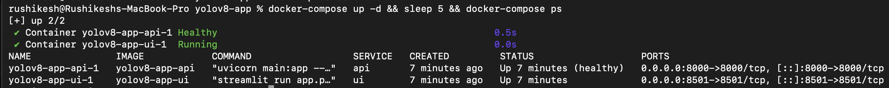
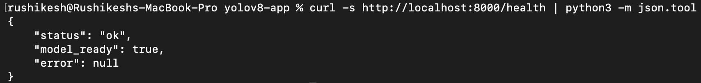
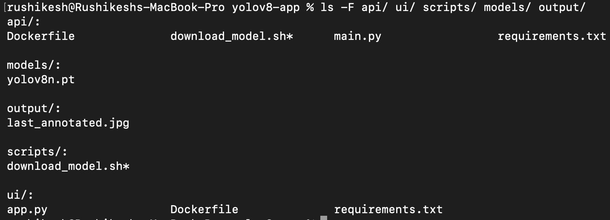
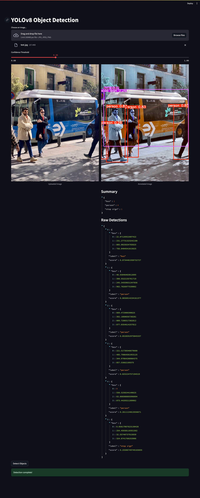
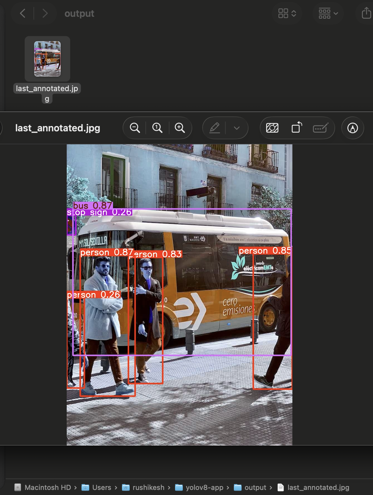

# YOLOv8 Object Detection API - Production-Ready Computer Vision Service

## Overview

This project implements a production-ready, containerized object detection inference service built with FastAPI, Streamlit, and Ultralytics YOLOv8. It demonstrates a complete microservices workflow: separation of concerns between backend and frontend, automated model management, security hardening for PyTorch dependencies, and volume-based data persistence.

The system exposes REST endpoints for health checks and object detection, validated using Pydantic schemas. It features a custom inference pipeline that resolves recent PyTorch security constraints (WeightsUnpickler) and persists annotated detection results directly to the host machine for auditability.

---

## Key Features

- Microservices Architecture: Independent API and UI services orchestrated via Docker Compose.
- Resilient Inference Engine: Custom logic to handle PyTorch security restrictions (version 2.5.1 pinned).
- Data Persistence: Automatic mapping of inference results to the host machine via Docker Volumes.
- Automated Health Monitoring: Dedicated endpoints to verify model readiness before accepting traffic.
- Precision Filtering: Dynamic confidence thresholding for high-fidelity detection.
- Zero-Setup Deployment: Fully containerized environment requiring only Docker.

---

## Architecture Summary

- API Layer: FastAPI application exposing /health and /detect endpoints.
- UI Layer: Streamlit frontend for interactive image uploading and visualization.
- Model Layer: Ultralytics YOLOv8 (Nano) optimized for CPU inference.
- Infrastructure: Dockerized services orchestrated via Docker Compose with volume mapping.

---

## Project Structure
```
.
├── api/
│   ├── main.py
│   ├── Dockerfile
│   └── requirements.txt
├── ui/
│   ├── app.py
│   ├── Dockerfile
│   └── requirements.txt
├── scripts/
│   └── download_model.sh
├── models/
├── output/
├── screenshots/
├── docker-compose.yml
├── .env.example
└── README.md
```

## Prerequisites

- Docker
- Docker Compose
- Git
- curl (for testing)

No local Python environment setup is required to run the application, but a host-side script execution is required for model initialization.

---

## Environment Configuration

The application uses environment variables for configuration. An example file is provided: .env.example.

### Key Variables

- API_PORT: Port for the backend service (default: 8000)
- UI_PORT: Port for the frontend service (default: 8501)
- MODEL_PATH: Internal container path to the model (default: /app/models/yolov8n.pt)
- CONFIDENCE_THRESHOLD_DEFAULT: Default detection sensitivity (default: 0.25)

---

## Running the System (End-to-End)

The recommended flow is to use Docker Compose to bring up the services. Follow these steps strictly to ensure the Docker Volumes are populated correctly.

### 1. Clone the Repository

```bash
git clone https://github.com/Rushikesh-5706/yolov8-detection-api-app.git
cd yolov8-detection-api-app
```

### 2. Download Model to Host (CRITICAL STEP)

STOP: Before running Docker, you must execute the download script on your host machine. This populates the models/ directory so it can be mounted into the container. Skipping this will result in a "File not found" error during API startup.

```bash
chmod +x scripts/download_model.sh
./scripts/download_model.sh
```

Expected output:

```
Downloading YOLOv8n model...
Download complete: models/yolov8n.pt
```

### 3. Build and Start Services

```bash
docker-compose up --build -d
```

This starts:
- Object Detection API on http://localhost:8000
- Streamlit UI on http://localhost:8501

### 4. Wait for services to be healthy

```bash
docker ps
```

---

## Verification Guide

### API Health Check

```bash
curl -s http://localhost:8000/health | python3 -m json.tool
```

Expected response:

```json
{
  "status": "ok",
  "model_ready": true
}
```

### Valid Prediction (CLI Test)

```bash
curl -s -o test.jpg https://raw.githubusercontent.com/ultralytics/ultralytics/main/ultralytics/assets/bus.jpg

curl -X POST "http://localhost:8000/detect" \
  -H "Content-Type: multipart/form-data" \
  -F "image=@test.jpg" \
  -F "confidence_threshold=0.25" | python3 -m json.tool
```

Expected Result: 200 OK with a JSON body containing a detections list and a summary object (e.g., {"bus": 1, "person": 4}).

---

## Persistence Verification

The application is configured to save the annotated result of the last detection directly to your host machine's output/ folder.

```bash
ls -lh output/last_annotated.jpg
```
Expected output: File details showing a valid image size (e.g., 300KB+). This confirms the Docker Volume mapping is functioning correctly.

---

## User Interface
Open http://localhost:8501 and:
- Upload an image
- Adjust confidence threshold
- Click Detect Objects

---
## Screenshots

### 1. Infrastructure Status
**Verification:** Output of `docker ps` confirming the `api` and `ui` containers are active and healthy.



### 2. API Health Endpoint
**Status:** JSON response from `/health` confirming the YOLOv8 model is successfully loaded into memory.



### 3. Project Structure
**Organization:** Tree view showing the clean separation of services (`api`, `ui`) and artifacts (`models`, `output`).



### 4. UI Detection Result
**Visualization:** Streamlit interface displaying the uploaded image with bounding boxes and the summary table.



### 5. Data Persistence
**Persistence:** Proof that the processed image was saved to the host's `output/` directory, satisfying the volume requirement.



---

## Docker Images

Prebuilt Docker images are available on Docker Hub:

Repository: "https://hub.docker.com/r/rushi5706/yolov8-detection-app"

Tags:

- api: Backend service
- ui: Frontend service

---

## Troubleshooting

Model not found error

```bash
docker-compose down
./scripts/download_model.sh
docker-compose up -d
```

Port already allocated:

```bash
lsof -ti:8000,8501 | xargs kill -9
```

---

## Conclusion
This project delivers a robust, reproducible object detection system. By adhering to strict volume mapping and dependency pinning, it ensures reliable performance across different deployment environments.
